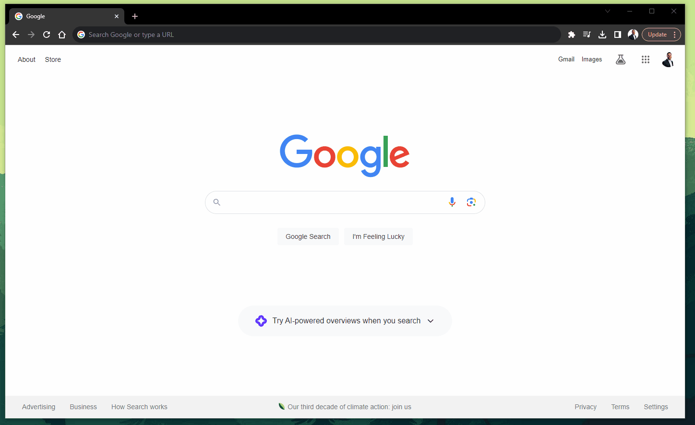

<br>

`PomodoroTimerOnline` is a web application that monitors and tracks study time.

<br>



**Usage**
---

```
To use the pomodoro timer application, open the application at the web address:
(https://pomodoro-timer-online-634cce94af27.herokuapp.com/)
and use the application as a guest. Then, click either study 
for 25 minutes or 50 minutes. A timer will be set for 
the selected time. At that point, you can pause the timer or stop it completely.
At the end of the study time, an alarm will go off prompting you to take a 
break for a specified amount of time depending on how long you have studied.
The timer will be set for the break when the user clicks start break.
```

**How to Contribute**
---

1. Clone repo and create a new branch: `$ git checkout https://github.com/AftonLawver/PomodoroTimerOnline -b name_for_new_branch`.
2. Make changes and test
3. Submit Pull Request with comprehensive description of changes

**Features in Progress**
---
- Implement data persistence through use of a web hosted MySQL database that stores
all user info and study session info. 

**Bugs to fix**
---
- Height of main content on phone is too large. Make for allow scroll if content goes out of view.
- Make password repeat show invalid if empty
- Make another input field for repeat email.